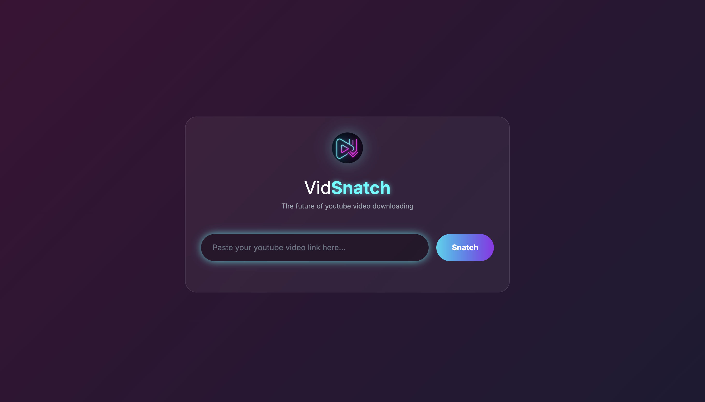

<div align="center">
  
  
  # VidSnatch 🚀
  
  *The future of YouTube video downloading - Web App & MCP Server*
</div>

VidSnatch is a futuristic YouTube video downloader with both a sleek web interface and powerful command-line tools. **Now also available as a Model Context Protocol (MCP) server** for AI assistants and programmatic access. Built for the next generation with a stunning UI that appeals to Gen Z and Gen Alpha users.

## Features

- 🌟 **Futuristic Web Interface**: Beautiful glassmorphism UI with aurora background
- 📱 **Mobile-First Design**: Responsive design that works on all devices
- 🎥 **High-Quality Downloads**: Support for up to 4K video downloads with automatic audio merging
- 🎵 **Audio Extraction**: Download audio-only files as MP3
- 📝 **Transcript Download**: Extract video transcripts with timestamps
- ✂️ **Video Trimming**: Download specific segments of videos with precise timestamp control
- ⚡ **Real-Time Processing**: Live video info fetching and download progress
- 💻 **Command-Line Interface**: Powerful CLI for automation and scripting
- 🤖 **MCP Server**: Model Context Protocol server for AI assistants and programmatic access
- 🚀 **Modern Tech Stack**: Built with UV, FastAPI, and Tailwind CSS

## Installation

Make sure you have UV installed. If not, install it first:

```bash
curl -LsSf https://astral.sh/uv/install.sh | sh
```

Then install the project dependencies:

```bash
uv sync
```

## Testing

To run the test suite:

```bash
# Run all tests
uv run python -m pytest tests/ -v

# Run specific test file
uv run python -m pytest tests/test_transcript.py -v
```

## Usage

### 🐳 Running with Docker

You can run VidSnatch using the pre-built Docker image from Docker Hub.

1.  **Pull the Docker image:**
    ```bash
    docker pull sahajamit/vidsnatch:0.3
    ```

2.  **Run the Docker container:**
    ```bash
    docker run -p 8080:8080 sahajamit/vidsnatch:0.3
    ```

3.  **Open your browser:**
    Navigate to `http://localhost:8080`

### 🌐 Web Interface (Recommended)

VidSnatch features a stunning futuristic web interface that's perfect for everyday use:



#### Launch the Web App

1. **Start the server:**
   ```bash
   uv run python web_app.py
   ```

2. **Open your browser:**
   Navigate to `http://localhost:8080`

3. **Start downloading:**
   - Paste any YouTube URL into the input field
   - Click "Snatch" to fetch video info
   - Select your desired video quality or transcript language
   - Click "Download Video", "Download MP3", or "Download Transcript"

#### ✂️ Video Trimming Feature

VidSnatch now supports precise video trimming to download specific segments:

1. **Load a video:** Paste a YouTube URL and click "Snatch Video Info"
2. **Navigate to Trim Video section:** Scroll down to the "✂️ Trim Video" panel
3. **Select time range using sliders:**
   - **Start Time Slider:** Drag to set the beginning of your segment
   - **End Time Slider:** Drag to set the end of your segment
   - **Visual Timeline:** See your selection highlighted on the progress bar
   - **Time Display:** View exact start/end times and segment duration
4. **Choose quality:** Select video quality for the trimmed segment
5. **Download:** Click "Download Trimmed Video" to get your custom segment

**Features:**
- **Precise Control:** Frame-accurate trimming with visual feedback
- **Real-time Preview:** See exact timestamps and duration as you adjust
- **Quality Selection:** Choose from available video qualities
- **Smart Validation:** Prevents invalid time ranges automatically

The web interface features:
- **Real-time video info fetching**
- **Quality selection with visual feedback**
- **Video trimming with interactive sliders**
- **Transcript download with timestamps**
- **Fancy loading animations**
- **Automatic file downloads**
- **Mobile-responsive design**

### 💻 As a Python module

```python
from youtube_downloader import YouTubeDownloader

# Create downloader instance
downloader = YouTubeDownloader()

# Download video
downloader.download_video("https://www.youtube.com/watch?v=VIDEO_ID", output_path="./downloads")

# Download audio only
downloader.download_audio("https://www.youtube.com/watch?v=VIDEO_ID", output_path="./downloads")

# Download transcript with timestamps
downloader.download_transcript("https://www.youtube.com/watch?v=VIDEO_ID", output_path="./downloads")

# Download a trimmed video segment (start_time and end_time in seconds)
downloader.download_video_segment("https://www.youtube.com/watch?v=VIDEO_ID", 
                                 start_time=30, end_time=120, 
                                 output_path="./downloads", quality="720p")
```

### ⚡ Command Line Interface

VidSnatch also provides a powerful command-line interface for automation and scripting:

**Download a Video**

To download a video at the highest available resolution, run:
```bash
uv run python -m youtube_downloader --url "https://www.youtube.com/watch?v=VIDEO_ID" --type video
```

To save the video to a specific folder, use the `--output` flag:
```bash
uv run python -m youtube_downloader --url "https://www.youtube.com/watch?v=VIDEO_ID" --type video --output ./my_videos
```

**Control Video Quality**

You can control the video quality using the `--quality` flag. Here are the available options:

-   **`highest`**: Automatically selects the best available resolution. For qualities above 720p, it will download and merge separate video and audio files to provide the best quality.
-   **`lowest`**: Selects the lowest available resolution.
-   **Specific Resolutions**: You can provide a specific resolution string. Common options include:
    -   `144p`
    -   `240p`
    -   `360p`
    -   `480p`
    -   `720p`
    -   `1080p` (Full HD)
    -   `1440p` (2K)
    -   `2160p` (4K)

*Note: The availability of these resolutions depends on the original video uploaded to YouTube.*

```bash
# Download in 720p
uv run python -m youtube_downloader --url "https://www.youtube.com/watch?v=-8A1iyh1-CM" --type video --quality 720p

# Download in lowest quality
uv run python -m youtube_downloader --url "https://www.youtube.com/watch?v=-8A1iyh1-CM" --type video --quality lowest
```

**Download Audio Only**

To download only the audio from a video, use `--type audio`. The audio will be saved as an MP3 file.

```bash
uv run python -m youtube_downloader --url "https://www.youtube.com/watch?v=-8A1iyh1-CM" --type audio --quality 720p --output ./my_audio
```

**Get Video Information**

To see information about a video without downloading it, use `--type info`:
```bash
uv run python -m youtube_downloader --url "https://www.youtube.com/watch?v=VIDEO_ID" --type info
```

### Building and Publishing Docker Images

To build and push multi-platform Docker images:

1. **Create or use a buildx builder:**
   ```bash
   # Option 1: Create new builder (remove existing if needed)
   docker buildx rm multiplatform 2>/dev/null || true
   docker buildx create --name multiplatform --use
   
   # Option 2: Use existing builder
   docker buildx use multiplatform
   
   # Option 3: Use default builder
   docker buildx use default
   ```

2. **Build and push for multiple platforms:**
   ```bash
   docker buildx build --platform linux/amd64,linux/arm64 -t sahajamit/vidsnatch:latest -t sahajamit/vidsnatch:0.3 --push .
   ```

3. **Build for linux/amd64 only (cloud platform compatible):**
   ```bash
   docker buildx build --platform linux/amd64 -t sahajamit/vidsnatch:latest -t sahajamit/vidsnatch:0.3 --push .
   ```

4. **Clean up Docker system (optional):**
   ```bash
   docker system prune -a
   ```

## 🤖 Model Context Protocol (MCP) Server

VidSnatch can also run as an MCP server, allowing AI assistants and other MCP clients to download YouTube videos and audio programmatically.

### MCP Features

The MCP server exposes the following tools:

- **get_video_info**: Get detailed information about a YouTube video
- **download_video**: Download video with specified quality/resolution
- **download_audio**: Download audio in various formats and qualities
- **download_transcript**: Download video transcripts in different languages
- **download_video_segment**: Download specific time segments from videos
- **list_downloads**: List all downloaded files
- **get_config**: View current server configuration

### Starting the MCP Server

VidSnatch supports both **stdio** and **HTTP** transports for maximum flexibility:

#### stdio Transport (Local)
```bash
# Start stdio MCP server (original)
python3 mcp_server.py

# Or using the installed script
vidsnatch-mcp
```

#### HTTP Transport (Local & Remote)
```bash
# Start HTTP MCP server with streaming support
python3 mcp_http_server.py

# Or using the installed script
vidsnatch-mcp-http
```

The HTTP server provides:
- **Remote accessibility** - Run on one machine, access from another
- **SSE streaming** - Real-time progress updates for downloads
- **Web compatibility** - CORS support for browser-based clients
- **Multiple clients** - Handle concurrent connections

Default HTTP endpoint: `http://localhost:8090/mcp`

### MCP Configuration

The MCP server can be configured in two ways:

#### 1. Configuration File (`mcp_config.json`)
```json
{
  "download_directory": "./downloads",
  "default_video_quality": "highest",
  "default_audio_quality": "highest",
  "max_file_size_mb": 500,
  "allowed_formats": ["mp4", "webm", "mp3", "m4a"],
  "create_subdirs": true
}
```

#### 2. Environment Variables (Override config file)
- `VIDSNATCH_DOWNLOAD_DIR` - Custom download directory
- `VIDSNATCH_VIDEO_QUALITY` - Default video quality (e.g., "1080p", "720p", "highest")
- `VIDSNATCH_AUDIO_QUALITY` - Default audio quality (e.g., "highest", "128kbps")
- `VIDSNATCH_MAX_FILE_SIZE_MB` - Maximum file size in MB

Environment variables take precedence over the config file, allowing client-level customization.

### MCP Client Integration

#### Claude Desktop Configuration

To use VidSnatch with Claude Desktop, add this to your Claude Desktop configuration file:

**Location of config file:**
- **macOS**: `~/Library/Application Support/Claude/claude_desktop_config.json`
- **Windows**: `%APPDATA%\Claude\claude_desktop_config.json`

**Recommended Configuration (using UV with --directory flag):**
```json
{
  "mcpServers": {
    "vidsnatch": {
      "command": "/opt/homebrew/bin/uv",
      "args": [
        "run",
        "--directory",
        "/Users/amitrawat/Desktop/Amit/dev/ls-dev/VidSnatch",
        "python3",
        "mcp_server.py"
      ],
      "cwd": "/Users/amitrawat/Desktop/Amit/dev/ls-dev/VidSnatch"
    }
  }
}
```

**Alternative with direct Python path:**
```json
{
  "mcpServers": {
    "vidsnatch": {
      "command": "python3",
      "args": ["/Users/amitrawat/Desktop/Amit/dev/ls-dev/VidSnatch/mcp_server.py"],
      "cwd": "/Users/amitrawat/Desktop/Amit/dev/ls-dev/VidSnatch"
    }
  }
}
```

**Complete working Claude Desktop config:**
```json
{
  "mcpServers": {
    "vidsnatch": {
      "command": "/opt/homebrew/bin/uv",
      "args": [
        "run",
        "--directory",
        "/Users/amitrawat/Desktop/Amit/dev/ls-dev/VidSnatch",
        "python3",
        "mcp_server.py"
      ],
      "cwd": "/Users/amitrawat/Desktop/Amit/dev/ls-dev/VidSnatch"
    }
  }
}
```

**With custom download directory and settings:**
```json
{
  "mcpServers": {
    "vidsnatch": {
      "command": "/opt/homebrew/bin/uv",
      "args": [
        "run",
        "--directory",
        "/Users/amitrawat/Desktop/Amit/dev/ls-dev/VidSnatch",
        "python3",
        "mcp_server.py"
      ],
      "cwd": "/Users/amitrawat/Desktop/Amit/dev/ls-dev/VidSnatch",
      "env": {
        "VIDSNATCH_DOWNLOAD_DIR": "/Users/amitrawat/Downloads/VidSnatch",
        "VIDSNATCH_VIDEO_QUALITY": "1080p",
        "VIDSNATCH_AUDIO_QUALITY": "highest"
      }
    }
  }
}
```

#### Other MCP Clients

For other MCP clients, use the general configuration format:

```json
{
  "mcpServers": {
    "vidsnatch": {
      "command": "python3",
      "args": ["/path/to/vidsnatch/mcp_server.py"],
      "cwd": "/path/to/vidsnatch"
    }
  }
}
```

### MCP Tool Examples

**Download Video:**
```python
# Download highest quality video
result = download_video("https://youtube.com/watch?v=VIDEO_ID")

# Download specific resolution
result = download_video("https://youtube.com/watch?v=VIDEO_ID", resolution="720p")
```

**Download Audio:**
```python
# Download highest quality audio as MP3
result = download_audio("https://youtube.com/watch?v=VIDEO_ID")

# Download specific quality
result = download_audio("https://youtube.com/watch?v=VIDEO_ID", quality="128kbps")
```

**Download Video Segment:**
```python
# Download 30-second clip from 1:00 to 1:30
result = download_video_segment(
    "https://youtube.com/watch?v=VIDEO_ID", 
    start_time=60, 
    end_time=90
)
```

### Multiple Running Modes

VidSnatch supports multiple running modes:

- **Web App Mode**: `python3 web_app.py` - Interactive web interface
- **MCP Server Mode (stdio)**: `python3 mcp_server.py` - For AI assistants (local)
- **MCP Server Mode (HTTP)**: `python3 mcp_http_server.py` - For remote AI assistants and web clients
- **CLI Mode**: `python -m youtube_downloader` - Command-line interface

All modes can run independently without interference.

**📖 For detailed HTTP transport documentation, see [MCP_HTTP_README.md](MCP_HTTP_README.md)**

## Requirements

- Python 3.10+ (3.8+ for web app only)
- pytubefix library
- youtube-transcript-api library
- mcp library (for MCP server functionality)
- UV package manager
- ffmpeg (for audio conversion and video merging)

## License

MIT License